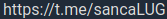

<!--<nav>-->
<!--  
 
Sumário
-->
<!--      <ol>-->
<!--      <li>Introdução</li>-->
<!--      <li><a href="#encontros-e-eventos">Encontros e eventos</a></li>-->
<!--      </ol>-->
<!--  
-->
<!--</nav>-->

**Olá!** :)  
O sancaLUG é um grupo que celebra software, hardware e cultura livre em geral, na cidade de São Carlos e região.
Organizamos eventos que vão de apresentações feitas por membros da comunidade, passando por festas de instalação de GNU/Linux e encontros informais.
Também fomentamos suporte e conversas em nosso grupo de mensagens. 
O nome sancaLUG é uma abreviação de São Carlos Linux User Group, cuja tradução é Grupo de usuários de Linux de São Carlos.

**Participe!**
Qualquer pessoa pode fazer parte: nossa comunidade é um conjunto eclético de pessoas de todos níveis e as áreas do conhecimento!

Telegram: {.t-antibot}  
Facebook: [https://www.facebook.com/sancaLUG](https://www.facebook.com/sancaLUG)  
GitHub: [https://github.com/sancaLUG](https://github.com/sancaLUG)  
[Código de conduta](https://github.com/sancaLUG/documentos/blob/master/codigo-de-conduta.md)

## Encontros e eventos

* *LUGBar*: encontro mensal para discussões descontraídas entre os membros do LUG.
* *Linux em prosa*: Comidas, bebidas e palestras. Esse é o modelo do Linux em Prosa. A comunidade se reúne para aprender e ensinar coisas novas!
* *Installfest*: festival de instalação de GNU/Linux em PCs de pessoas que desejam se aventurar nesse fantástico mundo FLOSS (Free, Libre and Open Source Software)!
* *Eventos singulares*: o LUG também organiza e colabora na produção de eventos como o Arduino Day, Software Freedom Day, Livre Game Jam, Mutirão de colaboração ao OpenStreetMap e outros!

**Próximos eventos**: em hiato... retornamos em breve!
Enquanto isso, participe do nosso grupo do Telegram!

Realizados anterioremente:

* 2019-10-12: LUGBar 14 (feedbacks de novos usuários Linux das últimas instalfests)
* 2019-06-15: Installfest no SESC
* 2019-06-01: Mutirão de colaboração ao OpenStreetMap #2
* 2019-03-23: Installfest na USP
* 2019-03-23: LUGBar de recepção na comunidade
* 2019-02-10: LUGBar 13
* 2019-01-26: LUGBar 12
* ... e outros mais, desde 2016-09-24!

___
Construído com [pandoc](https://pandoc.org/) e [water.css](https://github.com/kognise/water.css).
